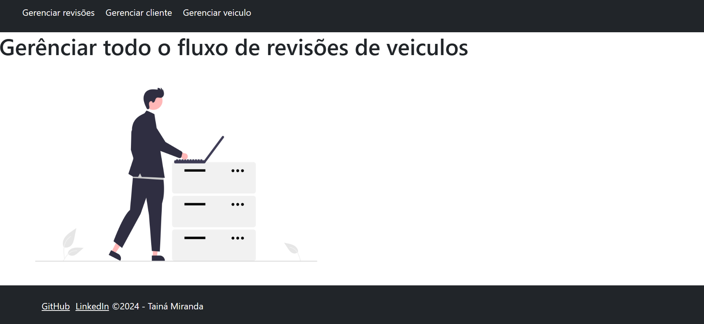
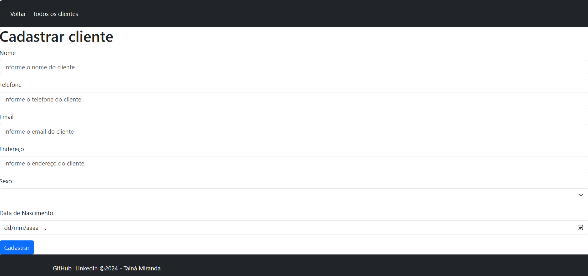
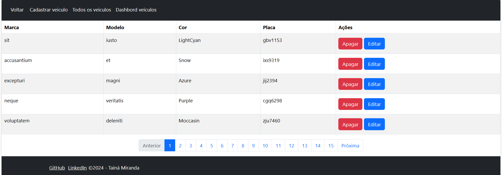
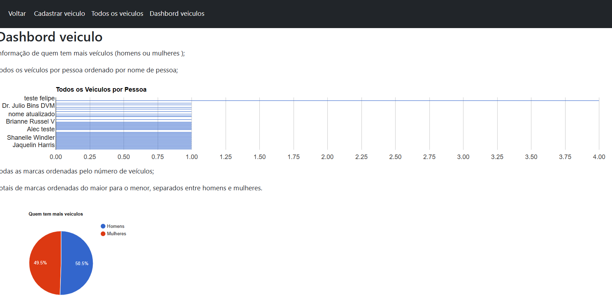

# CRUD para Veículos, Clientes e Revisões

Este projeto consiste em um sistema CRUD (Create, Read, Update, Delete) para gerenciar veículos, clientes e revisões.

## Capturas de tela

### Página Inicial (Home)


### Página de Cadastro de Cliente


### Todos os Veículos


### Dashboard com Gráfico


## Funcionalidades

- **Cadastro de Clientes:** Permite cadastrar novos clientes, incluindo nome, telefone, email, endereço, sexo e data de nascimento.
- **Cadastro de Veículos:** Permite cadastrar novos veículos, incluindo marca, modelo, cor e placa.
- **Cadastro de Revisões:** Permite registrar revisões para veículos, incluindo o veículo associado, tipo de serviço, quilometragem, detalhes e data da revisão.
- **Listagem e Edição:** Permite visualizar e editar informações de clientes, veículos e revisões.
- **Exclusão:** Permite excluir registros de clientes, veículos e revisões.

## Dependências

Este projeto utiliza as seguintes dependências:

- [Bootstrap](https://getbootstrap.com/): Para estilização e componentes de interface.
- [Axios](https://axios-http.com/): Para realizar requisições HTTP e consumir a API.

## Instalação

Para instalar as dependências necessárias, execute o seguinte comando no diretório raiz do projeto:

```
npm install
```

Isso instalará todas as dependências listadas no arquivo `package.json`.

## Paginação e Prevenção de Erros

O sistema utiliza paginação para exibir grandes conjuntos de dados, garantindo uma melhor experiência do usuário. Além disso, há prevenção de erros para validar campos obrigatórios e evitar a submissão de dados inválidos.
